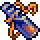
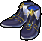
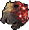
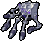
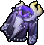
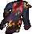
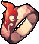
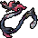

# 开拓，星遗泰拉 ！

## 简介
[开拓，星遗泰拉 ！](https://steamcommunity.com/sharedfiles/filedetails/?id=3374564713)是一个为游戏添加拓展内容的Mod，内容以[崩坏：星穹铁道](https://sr.mihoyo.com/)为原型，添加了一系列遗器，旨在增强游戏的多样性和乐趣。玩家可以通过探索、挑战不同的环境和敌人，收集和强化遗器，以提升角色的能力和战斗效果。  
（小声bb：在去年我还发布过一个[星穹铁道mod](https://steamcommunity.com/sharedfiles/filedetails/?id=3212263371)（[mod展示视频1](https://www.bilibili.com/video/BV17q421w7za),[mod展示视频2](https://www.bilibili.com/video/BV1s5gueDEKq)），但是由于像素画太难画以及时间不是很充裕，于是便没有更新了，但是后面时间充裕了应该会把旧mod的内容搬进来并且进行优化）。

## 遗器介绍

打开背包后即可点击按钮装备遗器，或在控件中绑定按钮来快捷打开（默认为R)。

### 遗器获取

使用星轨通票以获取隧洞遗器（示例：），在肉后使用星轨专票以获取位面饰品（示例：）。  
如图：  
  
星轨通票和星轨专票制作：10遗失晶块   

需要40点开拓力  才能使用星轨通票或星轨专票，每15秒回复一点。  

或者通过9金币制作燃料，使用后获得60点开拓力。

在不同的环境使用以获得不同的遗器套装：

- 获取详解：在不同的环境使用会被传送到不同的副本挑战中，击败副本中所有敌人后即可获取2个对应套装的随机遗器（简易模式是4个）
- 副本挑战：副本挑战中不可挖掘或建造，击败所有敌人后会自动退出副本，环境拥有优先级，以下排在前面的环境会覆盖后面的环境  
	- 隧洞遗器：  
	天空（）：  
	  
	大理石（）：  
	  
	花岗岩（）：  
	  
	墓地（）：  
	  
	地牢（）：  
	  
	发光蘑菇地（）：  
	  
	冰雪晚上（）：  
	  
	冰雪白天（）：  
	  
	海洋晚上（）：  
	  
	海洋白天（）：  
	  
	沙漠（）：  
	  
	蜂巢（）：  
	  
	丛林（）：  
	  
	猩红晚上（）：  
	  
	猩红白天（）：  
	  
	腐化（）：  
	  
	地下层（）：  
	  
	地狱晚上（）：  
	  
	地狱白天（）：  
	  
	洞穴层（）：  
	  
	森林晚上（）：  
	  
	森林白天（）：  
	  
	- 位面饰品：  
	陨石（）：  
	  
	天空晚上（）：  
	  
	天空白天（）：  
	  
	大理石（）：  
	  
	墓地（）：  
	  
	地牢（）：  
	  
	发光蘑菇地（）：  
	  
	冰雪（）：  
	  
	海洋（）：  
	  
	沙漠（）：  
	  
	蜂巢（）：  
	  
	丛林（）：  
	  
	猩红（）：  
	  
	腐化（）：  
	  
	地狱（）：  
	  
	洞穴（）：  
	  
	森林晚上（）：  
	  
	森林白天（）：  
	  

### 套装效果

和崩坏：星穹铁道中一样，本Mod的遗器也都有根据泰拉瑞亚游戏玩法而设计的相对应的套装效果。

#### 隧洞遗器
- **繁星璀璨的天才**（）：
  - 二件套：近战伤害提高5%
  - 四件套：盔甲穿透提高4点，当造成近战伤害时，盔甲穿透额外提高4点。

- **戍卫风雪的铁卫**（）：
  - 二件套：免伤提高3%
  - 四件套：当前生命值百分比小于等于50%时，立即回复生命上限4%的生命值，该效果有8秒冷却。

- **熔岩锻铸的火匠**（）：
  - 二件套：魔法伤害提高5%
  - 四件套：魔力消耗降低12%，使用魔力药水后，魔法伤害提高10%，持续3秒。

- **云无留迹的过客**（）：
  - 二件套：治疗量提高20%
  - 四件套：生命再生提高4点。

- **密林卧雪的猎人**（）：
  - 二件套：召唤伤害提高5%
  - 四件套：造成召唤伤害后，近战攻击速度提高10%，持续3秒。

- **盗匪荒漠的废土客**（）：
  - 二件套：远程伤害提高5%
  - 四件套：对37个图格以外的目标造成伤害时暴击率提高8%  
	对移动速度小于或等于自身的目标造成伤害时暴击伤害提高15%。

- **净庭教宗的圣骑士**（）：
  - 二件套：防御力提高10%
  - 四件套：当生命值高于25%时，吸收团队中其他玩家所受伤害的25%    
	如果团队中没有其他玩家，免伤提高6%。

- **宝命长存的莳者**（）：
  - 二件套：生命值提高5%
  - 四件套：受到大于或等于20%生命值的伤害后，暴击率提高8%，持续10秒。

- **激奏雷电的乐队**（）：
  - 二件套：魔法伤害提高5%
  - 四件套：魔力消耗提高100%    
	使用魔力药水后，下一次魔法伤害提高250%。

- **骇域漫游的信使**（）：
  - 二件套：移动速度提高8%
  - 四件套：使用生命药水后，团队中所有玩家移动速度和加速度乘以1.15倍，持续30秒。

- **野穗伴行的快枪手**（）：
  - 二件套：伤害提高4%
  - 四件套：移动速度提高12%
	近战伤害提高4%。

- **街头出身的拳王**（）：
  - 二件套：召唤伤害提高5%
  - 四件套：当上次的伤害为召唤物造成且这次的伤害为鞭子造成时  
	伤害提高5%，持续5秒，最多叠加五层  
	重复触发时刷新持续时间  
	若连续两次的伤害都是鞭子造成，则清空层数。

- **晨昏交界的翔鹰**（）：
  - 二件套：远程伤害提高5%
  - 四件套：消耗40个子弹后，移动速度和加速度乘以1.25倍，持续10秒。

- **流星追迹的怪盗**（）：
  - 二件套：有3%的概率闪避攻击
  - 四件套：有8%的概率闪避攻击  
	如果闪避失败，有50%的概率回复10点生命。

- **死水深潜的先驱**（）：
  - 二件套：对受到减益效果的目标造成的伤害提高6%
  - 四件套：暴击率提高2%  
	对陷入不少于1/2个减益效果的目标造成的暴击伤害提高8%/12%。

- **幽锁深牢的系囚**（）：
  - 二件套：伤害提高4%
  - 四件套：对受到持续伤害效果的目标造成伤害时，盔甲穿透提高8点。

- **毁烬焚骨的大公**（）：
  - 二件套：魔法伤害提高5%
  - 四件套：造成魔法伤害时，根据自身在75个图格以内发射的魔法弹幕的数量  
	每个使魔法伤害提高3%，最多叠加8次。

- **荡除蠹灾的铁骑**（）：
  - 二件套：免伤提高3%
  - 四件套：对18/12个图格以内的目标造成伤害时盔甲穿透提高5/15点。

- **风举云飞的勇烈**（）：
  - 二件套：远程伤害提高5%
  - 四件套：暴击率提高3%  
	当手持远程伤害武器且2秒内没有攻击时  
	下一次发射的远程弹幕的伤害、速度和击退提高500%。

- **重循苦旅的司铎**（）：
  - 二件套：移动速度提高8%
  - 四件套：使用生命药水后，团队中所有玩家的暴击伤害提高12%，持续30秒。

- **识海迷坠的学者**（）：
  - 二件套：暴击率提高4%
  - 四件套：召唤伤害提高10%  
	处于非静止状态时召唤伤害额外提高10%。

- **机心戏梦的钟表匠**（）：
  - 二件套：有3%的概率闪避攻击
  - 四件套：显示时间  
	有8%的概率闪避攻击  
	闪避成功后，团队中所有玩家的伤害提高12%，持续20秒。

#### 位面饰品
- **太空封印站**（）：
  - 二件套：
	近战攻击速度提高6%  
	每有一个召唤栏，近战攻击速度额外提高3%

- **停转的萨尔索图**（）：
  - 二件套：
	暴击率提高4%  
	当暴击率大于等于50%时，近战和魔法伤害提高8%

- **盗贼公国塔利亚**（）：
  - 二件套：
	有3%的概率闪避攻击  
	当移动速度大于场上血量上限最高的boss的速度时，有8%的概率闪避攻击

- **筑城者的贝洛伯格**（）：
  - 二件套：
	防御力提高10%  
	当免伤大于等于35%时，防御力额外提高10%

- **星体差分机**（）：
  - 二件套：
	暴击伤害提高10%  
	当暴击伤害大于110%时，暴击率提高8%

- **泛银河商业公司**（）：
  - 二件套：
	免伤提高4%  
	伤害提高，提高值为免伤的一半

- **苍穹战线格拉默**（）：
  - 二件套：
	伤害提高，提高值为10%乘以自身的移动速度除以场上血量上限最高的boss的速度  
	最多提高20%  
	若该boss静止或场上没有boss则直接使伤害提高20%

- **折断的龙骨**（）：
  - 二件套：
	免伤提高4%  
	当免伤大于等于35%时，团队中所有玩家的暴击伤害提高8%

- **梦想之地匹诺康尼**（）：
  - 二件套：
	魔力消耗降低12%  
	当团队中有两个或以上玩家的手持武器为魔法伤害武器时  
	团队中所有玩家的魔力消耗额外降低6%

- **繁星竞技场**（）：
  - 二件套：
	暴击率提高4%  
	当暴击率大于等于50%时，远程和召唤伤害提高8%

- **生命的翁瓦克**（）：
  - 二件套：
	移动速度提高8%  
	被攻击后移动速度额外提高200%，持续3秒

- **不老者的仙舟**（）：
  - 二件套：
	生命再生提高2点  
	处于静止状态时生命再生额外提高6点

- **奇想蕉乐园**（）：
  - 二件套：
	暴击伤害提高6%  
	场上有3个及以上自己的召唤物时暴击伤害额外提高12%

- **奔狼的都蓝王朝**（）：
  - 二件套：
	当团队中有两个或以上玩家的手持武器为召唤伤害武器时  
	团队中所有玩家的仆从数量上限增加1

- **沉陆海域露莎卡**（）：
  - 二件套：
	远程攻击速度提高12%  
	当团队中有两个或以上玩家的手持武器为远程伤害武器时  
	团队中所有玩家的远程攻击速度额外提高6%

- **出云显世与高天神国**（）：
  - 二件套：
	近战伤害提高12%  
	当团队中有两个或以上玩家的手持武器为近战伤害武器时  
	团队中所有玩家的近战伤害额外提高6%

- **劫火莲灯铸炼宫**（）：
  - 二件套：
	魔法伤害提高6%  
	拥有耐魔性减益时，魔力消耗降低10%  
	耐魔性减益的持续时间大于5秒时，魔力消耗额外降低20%

- **无主荒星茨冈尼亚**（）：
  - 二件套：
	暴击提高2%  
	每次消灭目标时，暴击伤害提高2%，持续5秒，最多叠加10层  
	重复触发时刷新持续时间

### 遗器等级

可以通过在遗器强化台处使用遗失晶块提升遗器的等级，随着等级的提高遗器的主词条和副词条都会得到一定程度上的加强

### 强化物品获取

- 遗器强化台：128遗失晶块 ，10银锭或钨锭，1钻石，3蓝玉  
- 遗失晶块 ：可以通过击杀几乎所有敌人获得，以及任意遗器都能分解成150个遗失晶块 
  - 掉落机制：
    - 普通模式：
      - 最小掉落数量：敌人钱币价值 ÷ 10 × 0.7
      - 最大掉落数量：敌人钱币价值 ÷ 10 × 1.3（保底为1）
    - 简易模式：
      - 最小掉落数量：敌人钱币价值 ÷ 5 × 0.7
      - 最大掉落数量：敌人钱币价值 ÷ 5 × 1.3（保底为2）

## 未来计划
本 Mod 未来可能会添加更多游戏内元素，例如：
- 新的武器与装备
- 独特的敌人和 Boss
- 扩展的任务系统
- 更多的环境和探索机制

## 贡献
欢迎任何形式的贡献！如果你发现问题或提供改进建议，请提交 issue 或 pull request。

## 联系
如需进一步信息或支持，请联系[哔哩哔哩@塔沐鸭](https://space.bilibili.com/3546565048273551?spm_id_from=333.1007.0.0)。

感谢你选择开拓，星遗泰拉 ！Mod，祝你在泰拉瑞亚的冒险中愉快！
